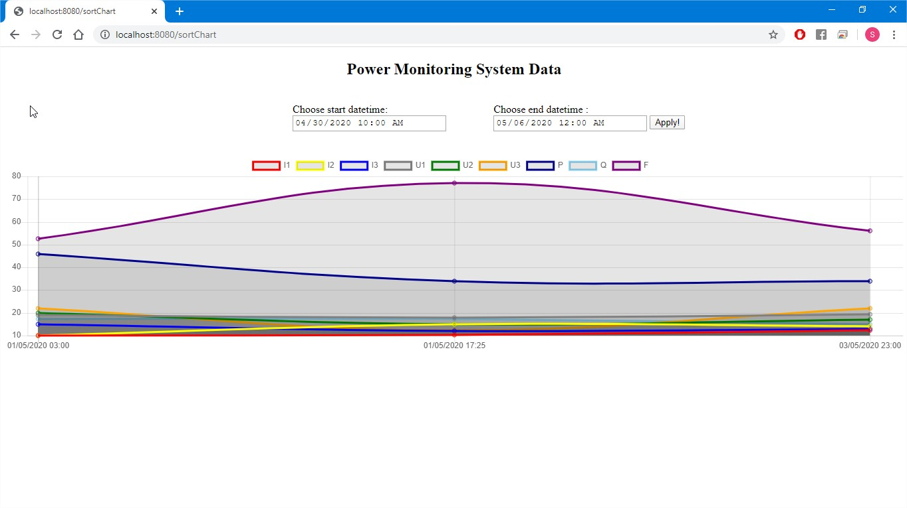

# Power Monitoring System

This is an Spring MVC application that displays measured data from a power sensor.

 REST API  
 GET --> http://localhost:8080/api/v1/energies  
 
 Email --> user@user.com  
 Password --> 123456789  

